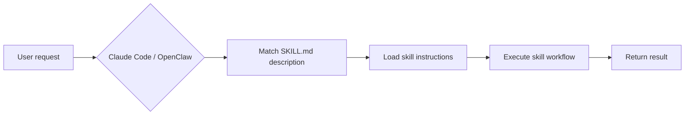

# openskills

Open-source AI agent skills for [OpenClaw](https://github.com/anthropics/openclaw) and Claude Code.

[](LICENSE)
[]()

[🇨🇳 中文版](README_CN.md)

<!-- AI-CONTEXT
project: openskills
one-liner: Open-source AI agent skills for OpenClaw and Claude Code
language: Markdown + Bash + Python
min_runtime: Claude Code or OpenClaw
package_manager: cp (manual copy to skills directory)
install: cp -r skills/<skill-name> ~/.openclaw/skills/
verify: ls ~/.openclaw/skills/<skill-name>/SKILL.md
-->

**Good for**: Developers using OpenClaw or Claude Code who want to add capabilities to their AI agent
**Not for**: Users who don't use AI agents

## Agent Quick Start

Copy this block to your AI assistant:

```bash
# Download the skill collection
git clone https://github.com/huaguihai/openskills.git
cd openskills

# Install a single skill (sentinel as example)
cp -r skills/sentinel ~/.openclaw/skills/
# Or for Claude Code users
cp -r skills/sentinel ~/.claude/skills/

# Verify installation
ls ~/.openclaw/skills/sentinel/SKILL.md  # Should print the file path

# Install all skills
for skill in skills/*/; do cp -r "$skill" ~/.openclaw/skills/; done
```

## Skills

| Skill | Description | Category |
|-------|-------------|----------|
| [sentinel](skills/sentinel/) | Unified security — skill vetting, dependency interception (3-layer defense), project health check, system audit | Security |
| [readme-writer](skills/readme-writer/) | Generate, optimize, or QA-check READMEs that serve both humans and AI agents, with S/M/L project grading | Docs |
| [blog-pipeline](skills/blog-pipeline/) | End-to-end blog writing pipeline with style enforcement and independent review | Writing |
| [public-apis](skills/public-apis/) | Find and recommend free public APIs across 51 categories | Dev |
| [opportunity-radar](skills/opportunity-radar/) | Indie dev opportunity discovery — 10 transformation strategies to find software business ideas | Business |
| [smart-fetch](skills/smart-fetch/) | Smart web scraping router — auto-selects the right tool (Jina/WebFetch/curl) for any URL | Utility |
| [grok-image](skills/grok-image/) | AI image generation and editing using Grok Imagine models | Creative |
| [auto-approve](skills/auto-approve/) | Analyze tool approval logs, discover high-frequency patterns, add to auto-approve list | Efficiency |

## Installation

```bash
# Install a single skill
cp -r skills/<skill-name> ~/.openclaw/skills/

# Or for Claude Code users
cp -r skills/<skill-name> ~/.claude/skills/

# Install all skills
for skill in skills/*/; do cp -r "$skill" ~/.openclaw/skills/; done
```

For sentinel's auto-interception (M2), you also need to configure Claude Code hooks — see [sentinel/SKILL.md](skills/sentinel/SKILL.md).

## How It Works



Each skill is a standalone directory. The core is `SKILL.md`:

1. **Trigger**: Claude matches the user's request against the `description` field in SKILL.md frontmatter
2. **Load**: On match, the SKILL.md body is loaded into context
3. **Execute**: Follow instructions — read `references/`, run `scripts/`, call tools
4. **Output**: Complete the task and return results

### Skill directory structure

```
skills/<name>/
├── SKILL.md       # Required: trigger description + instructions
├── references/    # Optional: reference docs (loaded on demand, saves tokens)
├── scripts/       # Optional: executable scripts for deterministic tasks
└── assets/        # Optional: templates, icons, static files
```

## Troubleshooting

**Skill not triggering after install?**
→ Verify the file is in place: `ls ~/.openclaw/skills/<name>/SKILL.md`. Skill triggering is description-based — try phrasing your request closer to the skill's description

**Want to install to Claude Code instead of OpenClaw?**
→ Replace `~/.openclaw/skills/` with `~/.claude/skills/`, everything else is the same

**How to write your own skill?**
→ Look at any existing skill's SKILL.md for the format. Core: YAML frontmatter (name + description) + Markdown instruction body

## License

[MIT](LICENSE)
