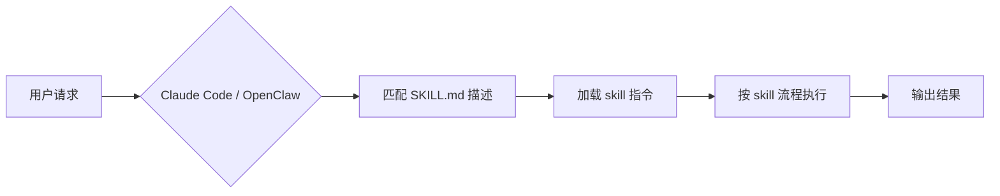

# openskills

开源 AI Agent 技能集，适用于 [OpenClaw](https://github.com/anthropics/openclaw) 和 Claude Code。

[](LICENSE)
[]()

[🇺🇸 English](README.md)

<!-- AI-CONTEXT
project: openskills
one-liner: 开源 AI Agent 技能集（OpenClaw / Claude Code）
language: Markdown + Bash + Python
min_runtime: Claude Code 或 OpenClaw
package_manager: cp（手动复制到 skills 目录）
install: cp -r skills/<skill-name> ~/.openclaw/skills/
verify: ls ~/.openclaw/skills/<skill-name>/SKILL.md
-->

**适合**：使用 OpenClaw 或 Claude Code 的开发者，想给 AI Agent 加技能
**不适合**：不用 AI Agent 的纯手动党

## Agent Quick Start

复制以下内容给你的 AI 助手：

```bash
# 下载整个技能集
git clone https://github.com/huaguihai/openskills.git
cd openskills

# 安装单个 skill（以 sentinel 为例）
cp -r skills/sentinel ~/.openclaw/skills/
# 或 Claude Code 用户
cp -r skills/sentinel ~/.claude/skills/

# 验证安装成功
ls ~/.openclaw/skills/sentinel/SKILL.md  # 应该输出文件路径

# 安装所有 skill
for skill in skills/*/; do cp -r "$skill" ~/.openclaw/skills/; done
```

## 技能列表

| 技能 | 简介 | 类型 |
|------|------|------|
| [sentinel](skills/sentinel/) | 统一安全防护 — Skill 审查、依赖拦截（三层防御）、项目体检、系统巡检 | 安全 |
| [readme-writer](skills/readme-writer/) | README 生成/优化/质检，同时服务人类和 AI Agent，支持 S/M/L 分级 | 文档 |
| [blog-pipeline](skills/blog-pipeline/) | 端到端博客写作流水线，含风格规范和独立审核 | 写作 |
| [public-apis](skills/public-apis/) | 从 51 个分类中查找和推荐免费公共 API | 开发 |
| [opportunity-radar](skills/opportunity-radar/) | 独立开发者商机发现 — 10 条转换策略，从产品/市场/资讯中挖方向 | 商业 |
| [smart-fetch](skills/smart-fetch/) | 智能网页抓取路由 — 自动选工具（Jina/WebFetch/curl），零依赖 | 工具 |
| [grok-image](skills/grok-image/) | AI 图片生成和编辑（Grok Imagine 模型） | 创意 |
| [auto-approve](skills/auto-approve/) | 分析工具授权日志，自动发现高频模式并加入授权清单 | 效率 |

## 安装

```bash
# 安装单个 skill
cp -r skills/<skill-name> ~/.openclaw/skills/

# 或 Claude Code 用户
cp -r skills/<skill-name> ~/.claude/skills/

# 安装所有 skill
for skill in skills/*/; do cp -r "$skill" ~/.openclaw/skills/; done
```

sentinel 的依赖自动拦截（M2）需要额外配置 Claude Code hooks，详见 [sentinel/SKILL.md](skills/sentinel/SKILL.md)。

## 工作原理



每个 skill 是一个独立目录，核心是 `SKILL.md`：

1. **触发**：Claude 根据 SKILL.md 的 `description` 字段判断是否匹配用户请求
2. **加载**：匹配后读取 SKILL.md 正文指令
3. **执行**：按指令调用工具、读取 `references/` 参考文件、运行 `scripts/` 脚本
4. **输出**：完成任务并返回结果

### Skill 目录结构

```
skills/<name>/
├── SKILL.md       # 必须有：触发描述 + 执行指令
├── references/    # 可选：参考文档（按需加载，节省 token）
├── scripts/       # 可选：可执行脚本（确定性任务）
└── assets/        # 可选：模板、图标等静态资源
```

## 常见问题

**安装后 skill 没触发？**
→ 确认文件在正确位置：`ls ~/.openclaw/skills/<name>/SKILL.md`。skill 触发靠描述匹配，试试用更接近描述的措辞

**想装到 Claude Code 而非 OpenClaw？**
→ 把 `~/.openclaw/skills/` 换成 `~/.claude/skills/`，其他一样

**怎么写自己的 skill？**
→ 参考任意一个现有 skill 的 SKILL.md 格式，核心是 YAML frontmatter（name + description）+ Markdown 指令体

## 许可证

[MIT](LICENSE)
